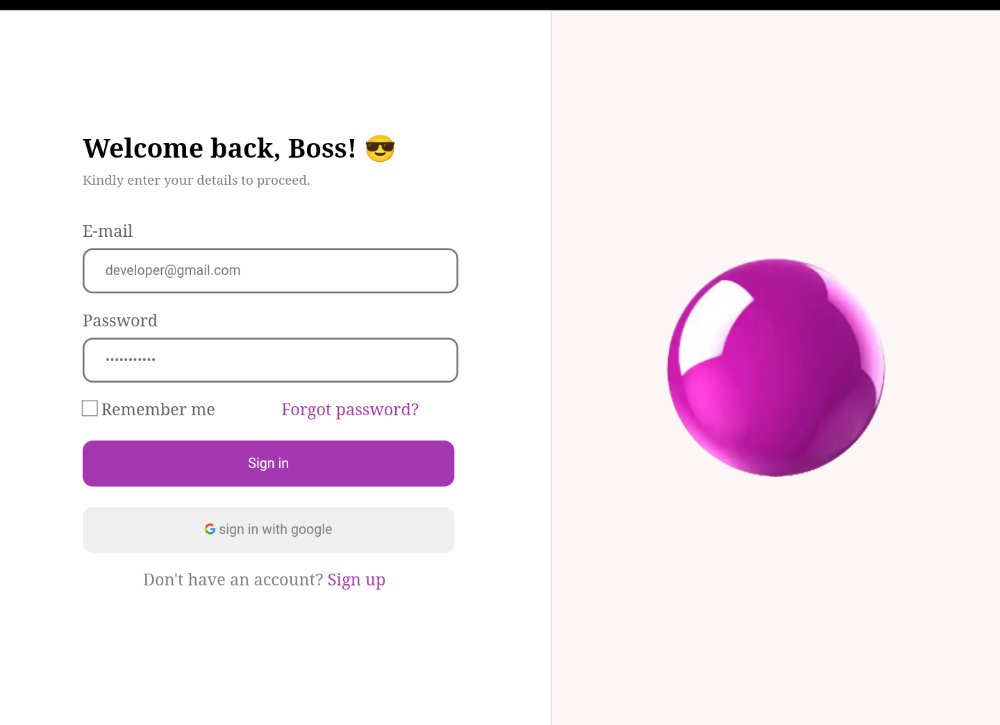

# Project - Simple Login/Signup Form


Responsive Signup/Login Form made with HTML and CSS.

## Table of contents

- [Overview](#overview)
  - [Screenshot](#screenshot)
  - [Link](#link)
- [My process](#my-process)
  - [Built with](#built-with)
  - [What I learned](#what-i-learned)
  - [Useful resources](#useful-resources)
- [Author](#author)


## Overview


### Screenshot

  - ##### Desktop Layout




### Links

- Live Site URL: [ Live Site ](https://jacbfrancis.github.io/Sign-up-page/)


## My process

### Built with

- Semantic HTML5 markup
- CSS custom properties


### What I learned

- learnt how to use HTML forms and iput types.

    ```html
      <form action="">
                    <label for="email">E-mail</label>
                    <input class="info"type="email" name="email" id="email" placeholder="developer@gmail.com" />
      </form>
    ```


### Useful resources

- [Responsive web design with media queries](https://www.w3schools.com/css/css_rwd_mediaqueries.asp) - This is an amazing article which helped me understand Responsive Web design and Media queries.


## Author

- Twitter - [@jacobxavier_](https://twitter.com/jacobxavier_?t=YdJHQngdQYJVbC7mWspqDg&s=08)

