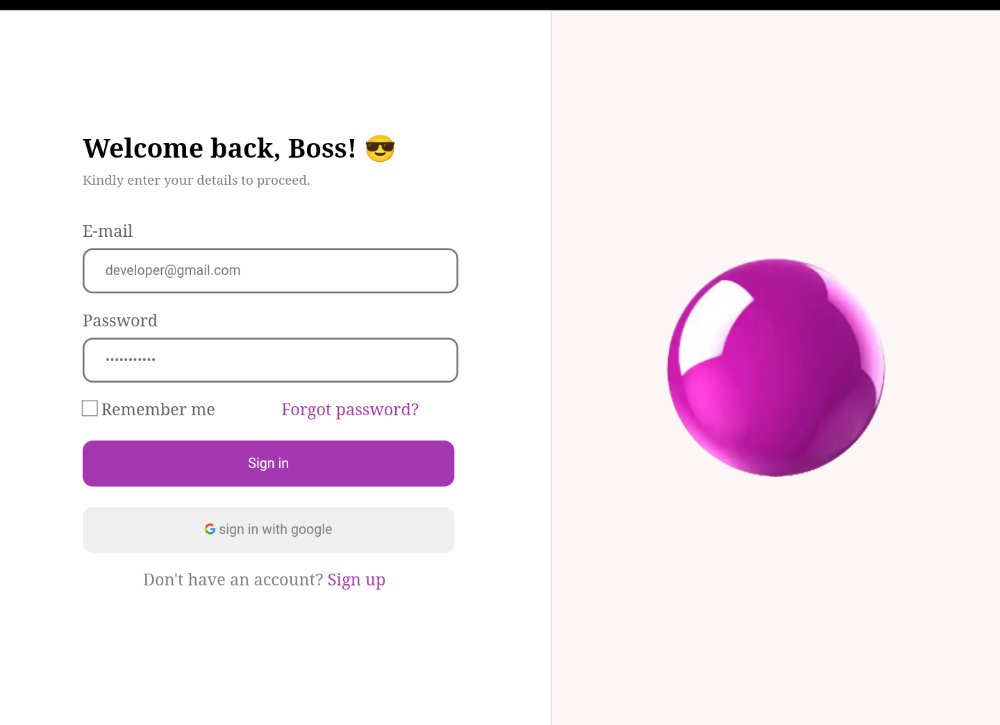
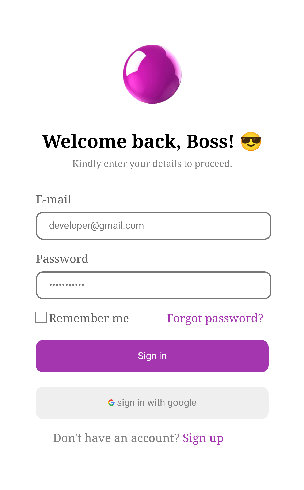

# Project - Simple Login/Signup Form

A simple Signup/Login Form made with HTML and CSS.

## Table of contents

- [Overview](#overview)
  - [Screenshot](#screenshot)
  - [Link](#link)
- [My process](#my-process)
  - [Built with](#built-with)
  - [What I learned](#what-i-learned)
  - [Continued development](#continued-development)
  - [Useful resources](#useful-resources)
- [Author](#author)

## Overview

### Screenshot

  - ##### Desktop Layout

  - ##### Mobile layout 

### Links

- Live Site URL: [ Live Site ](https://jacbfrancis.github.io/Sign-up-page/)

## My process

### Built with

- Semantic HTML5 markup
- CSS custom properties
- Flexbox
- Media Query
- Responsive web design 
- Desktop first workflow 

### What I learned

I learnt how to use media queries to modify specific characteristics depending on the device's viewport.

### Continued development

  - imorove my knowledge even further on css flexbox and Media queries.
  

### Useful resources

- [Responsive web design with media queries](https://www.w3schools.com/css/css_rwd_mediaqueries.asp) - This is an amazing article which helped me understand Responsive Web design and Media queries.

## Author

- Website - [ Francis Jacob](https://github.com/Jacbfrancis)
- Twitter - [@jacobxavier_](https://twitter.com/jacobxavier_?t=YdJHQngdQYJVbC7mWspqDg&s=08)

